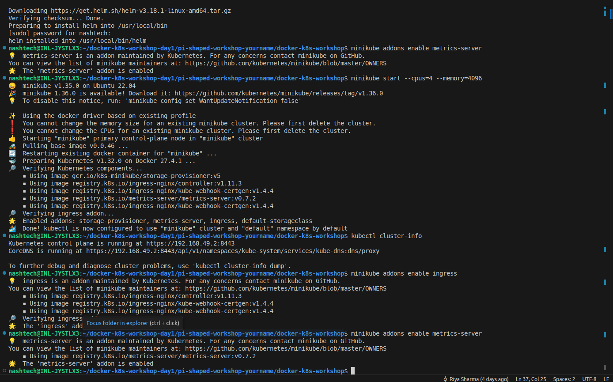
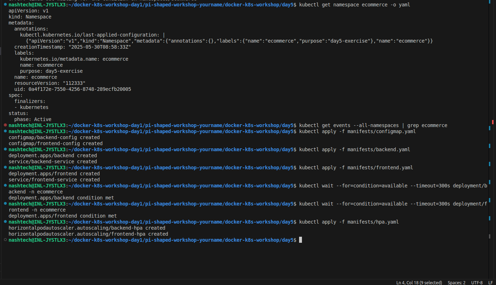
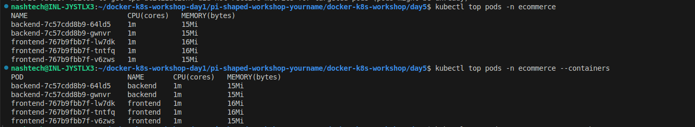
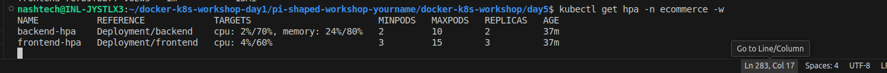

# Kubernetes Day 5: Real-world Use Cases & Optimization

## Assignment Overview

This project demonstrates a production-ready 2-tier e-commerce application deployed on Kubernetes with focus on performance optimization and cost efficiency. The implementation includes comprehensive resource management, health monitoring, and auto-scaling capabilities to handle real-world traffic patterns.

## Architecture

The application consists of:
- **Frontend**: nginx-based web server serving the user interface (3-15 replicas)
- **Backend**: nginx-based API server handling business logic (2-10 replicas)  
- **Auto-scaling**: HPA configured for both tiers with different scaling strategies
- **Health Monitoring**: Comprehensive liveness and readiness probes

## Implementation Tasks Completed

### 1. 2-tier Application Deployment
- ✅ Frontend deployment with nginx serving static content and API proxy
- ✅ Backend deployment with API endpoints simulation
- ✅ Service-to-service communication configuration
- ✅ ConfigMaps for application configuration

### 2. Resource Management & Health Probes
- ✅ Resource limits and requests for cost optimization
- ✅ Liveness probes for automatic container restart on failure
- ✅ Readiness probes for traffic management during startup/shutdown
- ✅ Optimized probe configurations for different service types

### 3. Horizontal Pod Autoscaler (HPA)
- ✅ CPU-based scaling for both frontend and backend
- ✅ Memory-based scaling for backend services
- ✅ Differentiated scaling policies for user-facing vs API services
- ✅ Custom scaling behaviors for scale-up/scale-down optimization

## Core Concept Questions & Answers

### 1.  Why are liveness and readiness probes critical in keeping a product's user experience stable and reliable?

**Liveness Probes - Ensuring Application Health:**

Liveness probes are essential for maintaining service reliability by detecting and recovering from application failures automatically. Here's why they're critical:

**Automatic Failure Recovery:**
- **Problem**: Applications can become unresponsive due to memory leaks, deadlocks, or infinite loops
- **Solution**: Liveness probes detect these "zombie" states and restart containers automatically
- **User Impact**: Prevents users from experiencing timeouts or hanging requests

**Reduced Mean Time to Recovery (MTTR):**
- **Traditional Approach**: Manual detection and restart (minutes to hours)
- **With Liveness Probes**: Automatic detection and restart (seconds to minutes)
- **Business Value**: Minimizes revenue loss during outages

**Real-world Example:**
```yaml
livenessProbe:
  httpGet:
    path: /health
    port: 80
  initialDelaySeconds: 10    # Allow startup time
  periodSeconds: 10          # Check every 10 seconds
  timeoutSeconds: 5          # 5-second timeout
  failureThreshold: 3        # Restart after 3 failures
```

**Readiness Probes - Traffic Management:**

Readiness probes ensure users never hit pods that aren't ready to serve requests:

**Zero-Downtime Deployments:**
- **During Updates**: New pods only receive traffic when fully initialized
- **During Scaling**: Pods are added to load balancer only when ready
- **During Startup**: Prevents routing to pods still loading dependencies

**Load Balancer Intelligence:**
- **Healthy Pods**: Receive traffic normally
- **Unhealthy Pods**: Automatically removed from rotation
- **Recovery**: Automatically re-added when health is restored

**Critical Scenarios:**
1. **Database Connection**: Pod needs time to establish DB connections
2. **Cache Warming**: Application needs to populate caches before serving traffic
3. **Service Dependencies**: Waiting for dependent services to be available
4. **Resource Initialization**: Loading configuration files or initializing memory structures

**Combined Impact on User Experience:**
- **No 5xx Errors**: Users never hit unhealthy or unready pods
- **Consistent Performance**: Traffic only goes to fully functional pods
- **Automatic Recovery**: Self-healing system reduces operational overhead
- **Reliable Deployments**: Updates happen without service interruption

### 2.   How does HPA help in handling flash sales, seasonal load spikes, or traffic surges in real-world applications like an e-commerce platform?

**Horizontal Pod Autoscaler (HPA) - Elastic Scaling for Business Critical Events:**

HPA provides automatic, intelligent scaling that directly supports business objectives during high-traffic events.

**Flash Sales Scenario:**

```
Pre-Sale (Normal):     100 RPS  → 3 frontend pods, 2 backend pods
Sale Announcement:     500 RPS  → 6 frontend pods, 4 backend pods  
Peak Shopping:       2,000 RPS  → 12 frontend pods, 8 backend pods
Checkout Rush:       3,000 RPS  → 15 frontend pods, 10 backend pods
Post-Sale:            200 RPS  → 4 frontend pods, 3 backend pods
```

**Business Value During Critical Events:**

**Revenue Protection:**
- **Problem**: Traffic spikes can crash applications, losing sales
- **HPA Solution**: Automatically scales to handle increased load
- **Business Impact**: Prevents revenue loss during peak selling periods

**Cost Optimization:**
- **Traditional**: Over-provision for peak capacity (expensive)
- **HPA Approach**: Scale up during spikes, scale down during normal periods
- **Savings**: 60-80% cost reduction compared to static over-provisioning

**Customer Experience:**
- **Fast Response Times**: Maintains performance during high traffic
- **No Timeouts**: Sufficient capacity prevents service degradation  
- **Consistent Availability**: Users can complete purchases without interruption

**Real-world Traffic Patterns HPA Handles:**

**1. Seasonal Spikes:**
- **Black Friday/Cyber Monday**: 10-50x traffic increase
- **Holiday Shopping**: Gradual ramp-up over weeks
- **Back-to-School**: Predictable annual patterns

**2. Geographic Traffic Waves:**
- **Morning Commute**: Traffic spikes in different time zones
- **Lunch Break Shopping**: Predictable daily patterns
- **Weekend Traffic**: Different usage patterns

**3. Viral Events:**
- **Social Media Mentions**: Sudden unpredictable traffic
- **Influencer Posts**: Rapid traffic spikes
- **News Coverage**: External events driving traffic

**HPA Configuration for E-commerce:**

**Frontend (User-facing) - Aggressive Scaling:**
```yaml
spec:
  minReplicas: 3
  maxReplicas: 15
  metrics:
  - type: Resource
    resource:
      name: cpu
      target:
        type: Utilization
        averageUtilization: 60  # Lower threshold for better UX
  behavior:
    scaleUp:
      stabilizationWindowSeconds: 30  # Quick response to traffic
      policies:
      - type: Percent
        value: 100    # Double capacity quickly
    scaleDown:
      stabilizationWindowSeconds: 600  # Slow scale-down for traffic patterns
```

**Backend (API) - Balanced Scaling:**
```yaml
spec:
  minReplicas: 2
  maxReplicas: 10
  metrics:
  - type: Resource
    resource:
      name: cpu
      target:
        averageUtilization: 70  # APIs can handle higher load
  - type: Resource
    resource:
      name: memory
      target:
        averageUtilization: 80  # Memory-based for data processing
```

**Key Benefits for E-commerce Platforms:**

**1. Automatic Response:**
- No manual intervention required during traffic spikes
- Scales based on actual demand, not predictions
- Responds faster than human operators

**2. Multi-dimensional Scaling:**
- CPU scaling for compute-intensive operations
- Memory scaling for data-heavy processes
- Custom metrics for business-specific needs

**3. Cost Efficiency:**
- Pay only for resources actually needed
- Automatic scale-down prevents waste
- Optimized for cloud cost models

**4. Reliability:**
- Prevents overload scenarios
- Maintains service quality during spikes
- Built-in safeguards against thrashing

## Deployment Steps

### Prerequisites
- Kubernetes cluster with metrics-server enabled
- kubectl configured to connect to your cluster



### Step 1: Deploy the Application
```bash
# Create namespace
kubectl create namespace ecommerce

# Deploy ConfigMaps
kubectl apply -f manifests/configmap.yaml

# Deploy applications
kubectl apply -f manifests/backend.yaml
kubectl apply -f manifests/frontend.yaml

# Deploy HPA
kubectl apply -f manifests/hpa.yaml
```





### Step 2: Verify Deployment
```bash
# Check all resources
kubectl get all -n ecommerce

# Verify HPA status
kubectl get hpa -n ecommerce

# Check pod resource usage
kubectl top pods -n ecommerce
```

### Step 3: Load Testing
```bash
# Apply load test job
kubectl apply -f load-test/load-test.yaml

# Monitor scaling in real-time
kubectl get hpa -n ecommerce -w
```

### Step 4: Monitor Scaling Events
```bash
# Watch HPA scaling decisions
kubectl describe hpa -n ecommerce

# Monitor pod resource usage during load
kubectl top pods -n ecommerce --containers
```

## 

### Initial Deployment State
<!-- Add screenshot of initial pod deployment -->


### Resource Usage During Load Test
<!-- Add screenshot of kubectl top pods during high load -->


### Scaling Event in Progress
<!-- Add screenshot of pods scaling up -->


### Resource usage
<!-- Add screenshot of pods scaling back down -->


## Key Optimizations Implemented

### Resource Management
- **CPU/Memory Limits**: Prevent resource starvation and control costs
- **Request Values**: Ensure guaranteed resources for consistent performance
- **Right-sizing**: Optimized for workload characteristics

### Scaling Strategy
- **Differentiated Policies**: Frontend vs Backend scaling optimized for their roles
- **Multi-metric Scaling**: CPU and Memory-based scaling for comprehensive coverage
- **Behavioral Controls**: Prevents rapid scaling oscillation

### Health Monitoring
- **Optimized Probe Timing**: Balanced between responsiveness and stability
- **Service-specific Configuration**: Different probe strategies for different service types
- **Failure Tolerance**: Appropriate thresholds for different failure scenarios

## Cleanup after completion
```bash
# Remove all resources
kubectl delete namespace ecommerce
```

---